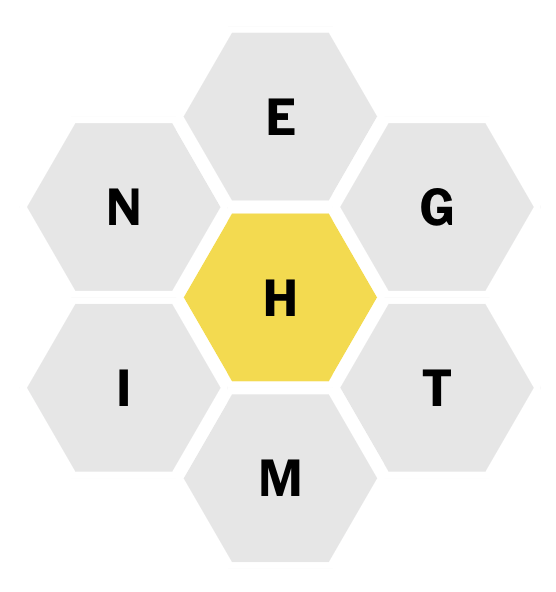

# BeeSolver - A Spelling Bee Solver

A solver for [NYT Spelling Game](https://www.nytimes.com/puzzles/spelling-bee).

In Spelling Bee, the player must come up with as many words as possible using only the letters on the game board. The center letter must be included in every word. All words must be at least 4 characters. The words must be deemed valid by NYT.

The solver will produce a list of guesses for you.

## How to use

- Launch the CLI with `node ./src/index.js`
- You will be prompted to enter the 6 letters around the circle.
- You will then be prompted to enter the center letter. If you choose to validate words (by entering 'y' or 'yes' when prompted), each of the guesses will be verified against the dictionary API to ensure that it has a definition.
- If you select interactive mode, the words will be shown to you one at a time. Move to the next word by pressing `enter`.
- Quit at any time using `CTRL-C`.
- The words will be written to a file in the `output` directory when the program finishes running. The file pattern for output files is `guesses_MMDD_HHmm.txt`.
- If 'validate' was selected, an additional file will be written called `validatedGuesses_MMDD_HHmm.txt`.
- A summary row will be written to `./summary.csv`.

## About the word list

The word list was taken from the [freeDictionaryAPI repo](https://github.com/meetDeveloper/freeDictionaryAPI). The raw data is in `./data/rawWords.txt`. The following pre-processing steps were performed:

- Filter out words contaning non-alphabetic characters
  - Keep: 'aargh', 'aam'
  - Remove: 'a bad apple', 'a-'
- Filter out words with less than 4 characters
  - Keep: 'aargh'
  - Remove: 'aam'
- Remove duplicates
- Convert all words to uppercase

This preprocessing step can be run with `node ./src/clean.js rawWords.txt`. The filename argument can point to any file inside of `./data`.

## Strategy

This program works by gradually filtering out words from the complete (preprocessed) word list.

- Filter out any words that do not contain the center letter
- Iterate over the letters in each word. Remove all words that contain letters not found in the game board.
- If the 'validate' option was selected, check each word against the free dictionary API to ensure that it has a definition. (Note: many validated words are not in the NYT approved list, so there will be a good amount of incorrect guesses anyway.)
